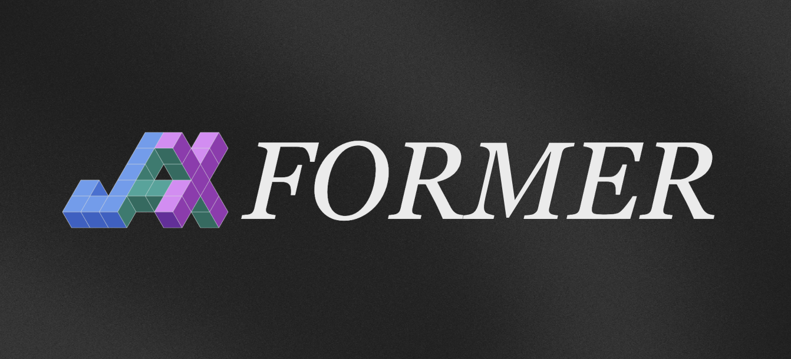

<picture>
  <source srcset="public/banner-light.png" media="(prefers-color-scheme: dark)">
  <source srcset="public/banner.png" media="(prefers-color-scheme: light)">
  
</picture>

 

# JAXformer

This is a zero-to-one guide on scaling modern transformers with n-dimensional parallelism in JAX. Our blog for [JAXformer](https://jaxformer.com) covers a from-scratch guide to distributed data processing, FSDP, pipeline parallelism, tensor parallelism, weight-sharding, activation-sharding, MoE scaling and much more. Our guide aims to bridge the gap between theory and end-to-end implementation by demonstrating how to scale a modern language model.

## Structure

The model built throughout the blog is defined in `model.py`. The main training script is in `main.py`. `utils.py` and `dataset.py` contain the dataclasses and dataset processing implementations. `debug_tpu.sh` launches a TMUX with 8 panes to SSH into 8 nodes at once running the command in the `command` variable. `launcher.sh` ssh's headlessly into each node and executves `run.sh` creating TMUX terminals inside the ssh to allow for runs to continue even if the ssh connection is broken. `setup_tpu.sh` setups all the dependencies on the TPU. The `data` directory contains all the relevant code for tokenization.

## Results

Results for a 1B model (300M active) trained to 3.28 val loss using 3-D sharding on a cluster of 32 TPU-v4(8 FSDP, 2 Pipeline, 2 Tensor).

### Val-Loss

  

### Load-Loss

  

### Expert-per-Head

  

## Contributing and Contact

If you see any issues or have questions, open up an issue or send in a PR. You can also leave a comment on the website itself (powered by Giscus) or in the GitHub discussion.

## Acknowledgements

This guide was written by Aditya Makkar, Divya Makkar, and Chinmay Jindal. The website uses a Distill-style Jekyll theme called [Al-Folio](https://github.com/alshedivat/al-folio). The idea of the blog and front-end structure is inspired by Google DeepMind's [How to Scale Your Model](https://jax-ml.github.io/scaling-book/) guide. [Google's TRC](https://sites.research.google/trc/about/) was used to provide the compute needed. Thanks!
